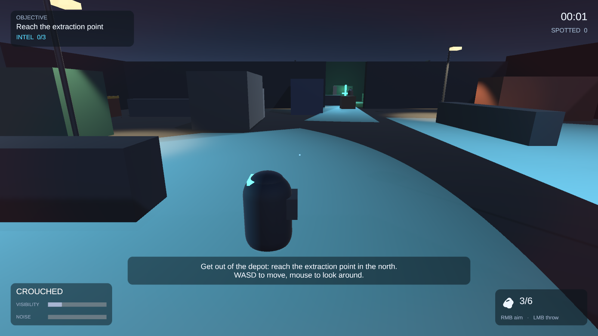
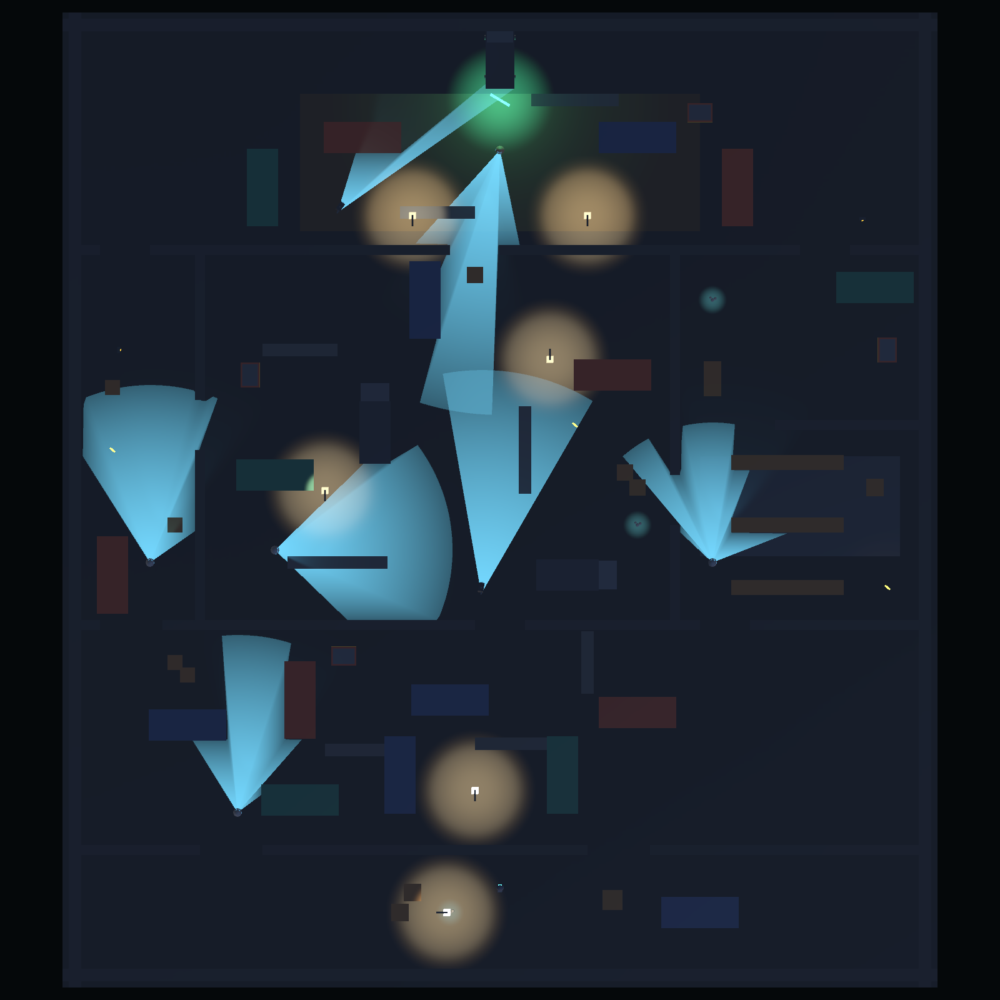

# Night Shift — Third Person Stealth Prototype



A playable stealth prototype built in **Unity 6000.5.8f1** (Built-in Render Pipeline).
You infiltrate a guarded depot at night, avoid patrols, cameras and sentries, and reach the extraction
point in the north of the map.

Everything in the project was made from scratch: geometry is built from primitives, and all sounds and
UI sprites are generated procedurally by a Python script (`Tools/generate_assets.py`). No third party
assets are used.

---

## How to play

| Action | Input |
| --- | --- |
| Move | `W A S D` |
| Look | Mouse |
| Sprint (fast, loud) | `Shift` |
| Crouch (slow, quiet, low profile) | `C` or `Ctrl` |
| Interact / hide / leave a hiding spot | `E` |
| Aim a stone | Hold right mouse button |
| Throw the stone | Left mouse button while aiming |
| Pause | `Esc` |

**Goal:** reach the extraction point (green beacon, north of the map).
**Failure:** a guard reaches you while chasing.
Being seen does not end the run by itself — it starts a chase, and the run is scored on how often it happened.

Optional: three intel cases are hidden in the riskiest corners of the level. They only affect the rank on
the end screen (`PERFECT GHOST`, `GHOST`, `SHADOW`, `SLOPPY`).

### Reading the game

* Every enemy projects its **field of view on the ground**. The cone is drawn with raycasts, so it wraps
  around walls exactly like the actual sensor.
* The **badge above an enemy** fills while it is noticing you: white/blue = calm, yellow `?` = suspicious,
  orange = walking over to check, red `!` = you have been identified.
* **Arrows around the screen centre** point at whoever is detecting you right now.
* The **bottom left panel** shows your stance, how visible you are (posture + light) and how loud you are.

---

## Getting a build

The compiled player is not committed (`Build/` is ignored). To produce one, either use
**File > Build Settings > Build** in the editor, or run the pipeline from the command line:

```
Unity.exe -batchmode -quit -projectPath . -executeMethod Stealth.EditorTools.StealthPipeline.BuildWindowsPlayer
```

It writes `Build/Windows/NightShift.exe` (Windows x64, ~93 MB). Run it, press **START MISSION** and play.

## Opening the project

1. Clone the repository and open the project folder with Unity **6000.5.8f1**.
2. Open `Assets/Scenes/MainMenu.unity` (title screen) or `Assets/Scenes/Level01_Depot.unity` (the mission).

The whole content of the game (materials, prefabs, both scenes, the navigation mesh) is generated by the
editor tools under the **Stealth** menu, so it can be rebuilt at any time:

| Menu item | What it does |
| --- | --- |
| `Stealth/Step 1 - Configure Project` | Layers, colour space, quality, TextMeshPro resources |
| `Stealth/Step 2 - Build Assets` | Import settings, materials, guard profiles, sound library |
| `Stealth/Step 3 - Build Prefabs` | Player, guards, camera, props, pickups |
| `Stealth/Step 4 - Build Level Scene` | The depot, the enemies, lighting, HUD, navmesh |
| `Stealth/Step 5 - Build Main Menu` | Title screen |
| `Stealth/Validate Level` | Checks that every patrol point and the exit are reachable |

---

## How the assignment is covered

### Nota 4 — basic requirements

| Requirement | Where it lives |
| --- | --- |
| Character movement with Unity physics | `Scripts/Player/PlayerMotor.cs` — `Rigidbody` driven movement in `FixedUpdate`, camera relative, with acceleration and a grounded check. The body is a `CapsuleCollider` that shrinks when crouching (`PlayerStance.cs`). |
| Enemy patrolling between points | `Scripts/Enemies/PatrolRoute.cs` (stops, wait times, look-around, loop or ping-pong) driven by `States/PatrolState.cs`. Five guards with different routes are placed in the level. |
| Detection by `Raycast`, respecting distance and obstacles | `Scripts/Perception/VisionSensor.cs` — checks distance, then the horizontal angle against the view cone, then casts a `Physics.Raycast` to three points of the body (head, chest, legs). A hit on anything that is not the player blocks the sighting. |
| A second detection zone with `SphereCollider` | `Scripts/Perception/ProximitySensor.cs` — a trigger sphere around every guard. It reacts to how loud the player is inside it, and notices anybody at arm's length even if they are silent. |
| Enemy reaction when detected | `States/ChaseState.cs` — the guard shouts, the badge turns into a red `!`, an alarm sting plays, nearby guards are called in over the radio (`AlertNetwork.cs`) and the guard runs the player down. |
| Level with start, goal and obstacles | `Assets/Scenes/Level01_Depot.unity`, generated by `Editor/LevelBuilder.cs`: start yard in the south, extraction point in the north, containers, crates, trucks, walls and low cover in between. |
| Win and lose conditions | `Scripts/Core/GameManager.cs` — `ReportGoalReached()` (trigger `Scripts/Level/LevelGoal.cs`) and `ReportPlayerCaught()`. The manager also has a `_loseWhenSpotted` switch that restores the strict "detection = defeat" rule of this level of the assignment. |

### Nota 7 — intermediate requirements

| Requirement | Where it lives |
| --- | --- |
| Different enemy states | `Scripts/Enemies/States/` — one class per state: `PatrolState`, `SuspiciousState`, `InvestigateState`, `ChaseState`, `SearchState`, `ReturnState`, plus `GuardStateMachine`. |
| Visual feedback for state and detection | Ground view cone (`Visuals/VisionCone.cs`) coloured per state, filling `?`/`!` badge (`Visuals/AlertIcon.cs`), guard barks (`Visuals/SpeechBubble.cs`), on-screen direction arrows (`UI/DetectionIndicators.cs`), screen vignette and flash (`UI/ScreenEffects.cs`), HUD banner (`UI/HUDController.cs`) and three music layers (`Audio/MusicDirector.cs`). |
| Multiple routes and cover | The depot has three parallel lanes — dark west alley, lit central yard, warehouse in the east — connected by gaps in the walls, plus full cover (containers, trucks) and low cover you can only use while crouching. |
| Hiding spot that breaks the chase; losing means being caught | `Scripts/Interaction/HidingSpot.cs` and `Scripts/Player/PlayerHiding.cs`. Hiding makes the player imperceptible and fires `StealthTargetLocator.NotifyHidden()`; every guard drops the chase, searches the area and goes back to patrol. Defeat now happens only when a chasing guard reaches the player. |
| More than one enemy with different routes or detection zones | Five guards (three archetypes: `Patrol Guard`, `Watchman`, `Sentry`) and two security cameras, each with its own `GuardProfile` asset in `Assets/Settings/`. |

### Nota 10 — advanced requirements

| Requirement | Where it lives |
| --- | --- |
| Code split by responsibility | 70 small scripts (~5 000 lines) in `Assets/Scripts/`, grouped into `Core` (5), `Player` (11), `Enemies` (17, of which 9 are the state machine), `Perception` (7), `Interaction` (5), `Level` (6), `Visuals` (6), `UI` (9) and `Audio` (4). Sensors, the detection meter, the state machine, the player systems and the HUD are all separate classes that talk through interfaces (`IStealthTarget`, `IPerceiver`, `IInteractable`, `INoiseListener`). |
| Progressive detection with several alert levels | `Scripts/Perception/DetectionMeter.cs` — a 0..1 meter that fills at a rate based on distance, posture, light and noise, holds after losing sight and then drains. It crosses `Unaware → Suspicious → Alerted → Detected`, and every step has its own guard behaviour and its own colour on screen. |
| Level combining enemies, routes, detection zones and alternative paths | See the level map below: three lanes, two gated checkpoints, cameras covering the shortcuts, a sentry guarding the final approach, and loud floors (gravel, metal grating) that punish running. |
| Extra stealth mechanic | Two of them: **throwable stones** (`Player/PlayerThrower.cs`, `Level/Stone.cs`, ballistic aiming in `Player/BallisticSolver.cs`) that drag guards away from their route, and **breaker switches** (`Interaction/LightSwitch.cs`) that kill a group of lamps so a lit route becomes sneakable. Plus intel pickups and refillable stone piles. |
| Presentation and polish | Night lighting with fog and per-guard flashlights, generated SFX and three-layer adaptive music, full HUD, pause menu, end screen with statistics and a rank, tutorial hints triggered by walking into the relevant place, and title screen. |

---

## The level



```
                      NORTH  (extraction point, green beacon)
        +-------------------------------------------------+
        |   gravel yard  ·  sentry with a long cone        |
        |   gate lamps (breaker in the warehouse corner)   |
        +----[gap]------------[gate]-----------[gap]-------+
        |  dark    |        main yard          | warehouse |
        |  alley   |  patrol + camera + lamps  | watchman  |
        |  patrol  |  trucks, crates, cover    | grating   |
        +----[gap]------------[gate]-----------[door]------+
        |            container maze  ·  patrol guard       |
        +----------[gap]--------------------[gap]----------+
        |                 start yard (stones)              |
        +-------------------------------------------------+
                      SOUTH  (player spawn)
```

Guards: `Guard_Alpha` (container maze), `Guard_Bravo` (dark alley), `Guard_Charlie` (main yard),
`Guard_Delta` (warehouse, wide cone and a big proximity bubble), `Guard_Echo` (sentry watching the
extraction approach). Cameras: `Camera_Gate` and `Camera_North` — they cannot chase, but they call
every guard within 30 m.

---

## Screenshots

`Docs/Screenshots/` holds shots taken straight out of a running session:
the level map, a guard's view cone, full detection, hiding, aiming a stone, the extraction point and the
victory screen. They are regenerated with the capture helper described in `Assets/Tests/SceneCaptureUtility.cs`.

## Automated tests

The project ships with Unity Test Framework tests (`Assets/Tests/`), runnable from
`Window > General > Test Runner` (PlayMode):

* `DetectionMeterTests` — the meter climbs through every level, holds, drains, and a single noise can never
  fully detect the player.
* `PerceptionTests` — the view cone respects distance, angle and walls; low cover hides a crouching player
  but not a standing one; the sphere zone reacts to noise only; noise events reach listeners in range only.
* `BallisticSolverTests` — a thrown stone lands where it was aimed.
* `MissionFlowTests` — loads the real level and checks the mission rules end to end: reaching the
  extraction point wins, a guard spots a player standing in the open and chases, detection is progressive,
  hiding breaks the chase, being caught ends the run, and a noise pulls a guard off its route.

---

## Project layout

```
Assets/
  Art/            materials, generated sprites, two small unlit shaders
  Audio/          31 generated wav files (footsteps, stings, music layers)
  Editor/         content generators: project setup, assets, prefabs, level, menu, build pipeline
  Prefabs/        Player, Guard, SecurityCamera, HidingSpot, StonePile, IntelPickup, LightSwitch, StreetLamp, ExtractionPoint, Stone
  Scenes/         MainMenu, Level01_Depot (+ its baked navmesh)
  Scripts/        gameplay code, grouped by responsibility
  Settings/       guard profiles and the sound library (ScriptableObjects)
  Tests/          play mode tests
Build/Windows/    the Windows player
Tools/            the Python asset generator
```
